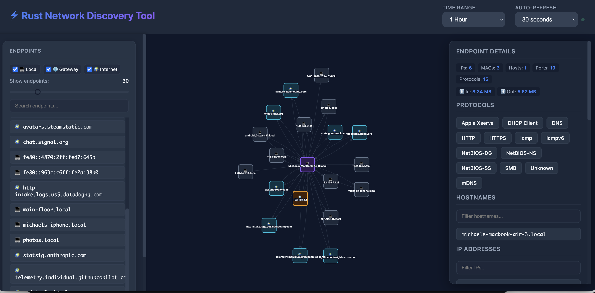
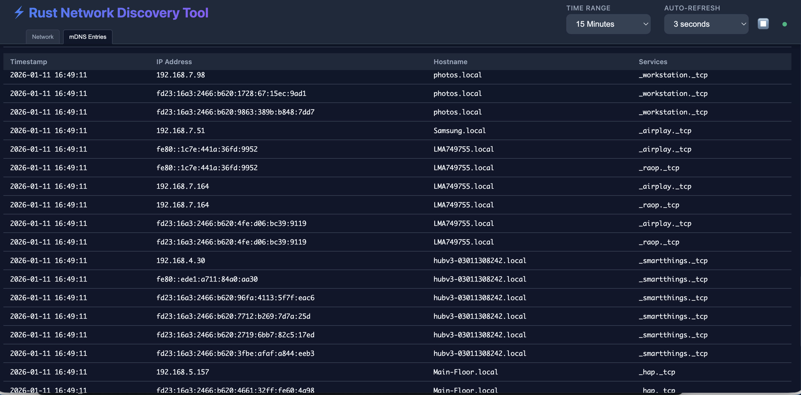
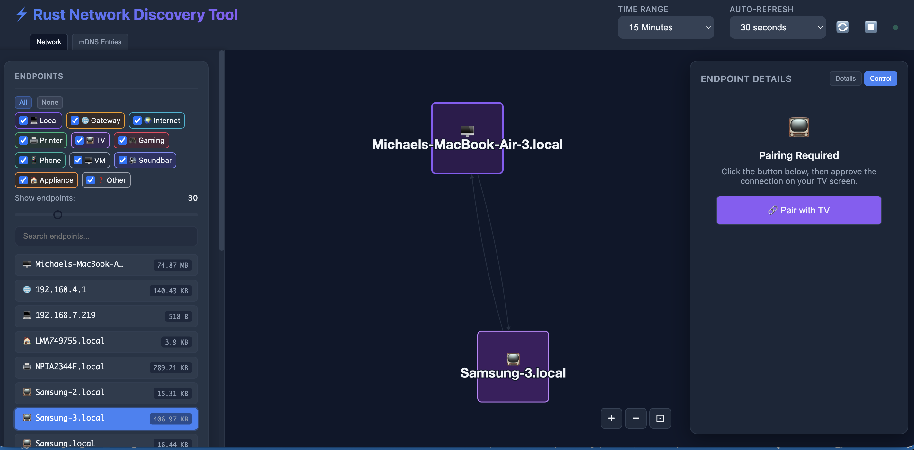
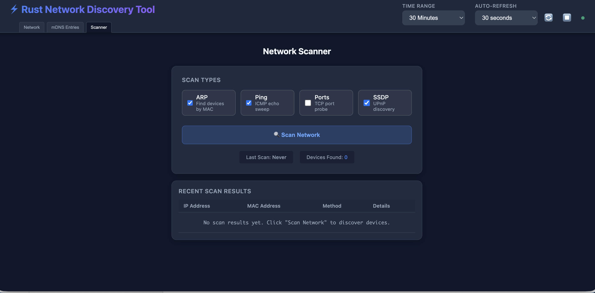

Rust Network Discovery Tool









A lightweight network traffic monitoring tool that captures and visualizes network connections on your local network. Shows "what's talking to what" in an easy-to-use web interface.

## Features
## Installation

### Pre-built Binaries

Download the latest release for your platform:

- **macOS (Apple Silicon)**: [rust_network_discovery_tool-macos-aarch64.tar.gz](https://github.com/mikemiles-dev/rust_network_discovery_tool/releases/latest/download/rust_network_discovery_tool-macos-aarch64.tar.gz)
- **macOS (Intel)**: [rust_network_discovery_tool-macos-x86_64.tar.gz](https://github.com/mikemiles-dev/rust_network_discovery_tool/releases/latest/download/rust_network_discovery_tool-macos-x86_64.tar.gz)
- **Linux**: [rust_network_discovery_tool-linux-x86_64.tar.gz](https://github.com/mikemiles-dev/rust_network_discovery_tool/releases/latest/download/rust_network_discovery_tool-linux-x86_64.tar.gz)
- **Windows**: [rust_network_discovery_tool-windows-x86_64.zip](https://github.com/mikemiles-dev/rust_network_discovery_tool/releases/latest/download/rust_network_discovery_tool-windows-x86_64.zip)

#### macOS/Linux Installation

```bash
# Download and extract (adjust filename for your platform)
tar -xzf rust_network_discovery_tool-macos-aarch64.tar.gz

# Make executable
chmod +x rust_network_discovery_tool

# Move to PATH (optional)
sudo mv rust_network_discovery_tool /usr/local/bin/

# Run with sudo (required for packet capture)
sudo rust_network_discovery_tool
```

#### Windows Installation

1. Download and extract the ZIP file
2. Install [Npcap](https://npcap.com/#download) (required for packet capture)
3. Run as Administrator (required for packet capture)

### Build from Source


- **Passive Monitoring**: Captures network traffic to see what's communicating
- **Active Network Scanning**: Discover devices that aren't actively communicating
  - **Automatic Scan on Startup**: Runs ARP and SSDP scans automatically when launched
  - **ARP Scanning**: Find all devices on your local subnet by MAC address (requires root/admin)
  - **ICMP Ping Sweep**: Discover responsive hosts via ICMP echo (requires root/admin)
  - **TCP Port Scanning**: Probe common ports (22, 80, 443, 8080, etc.) to identify services
  - **SSDP/UPnP Discovery**: Find smart devices, media servers, and IoT devices
- **Smart Interface Filtering**: Automatically monitors only real network interfaces (skips loopback, Docker, VPN)
- **Connection Deduplication**: Tracks unique connections instead of individual packets
- **Automatic Data Retention**: Keeps data for 7 days by default (configurable)
- **Privacy-Focused**: Doesn't store packet payloads, only connection metadata
- **Interactive Network Graph**: Click-to-navigate network visualization powered by Cytoscape.js
- **Protocol Detection**: Identifies HTTP, HTTPS, DNS, SSH, and 20+ other protocols
- **Hostname Resolution**: Uses DNS, mDNS, and deep packet inspection (SNI, HTTP Host headers)
- **Device Remote Control**: Control smart devices directly from the UI
  - **TVs**: Roku, Samsung, LG webOS (volume, playback, power, apps)
  - **LG ThinQ Appliances**: Dishwashers, washers, dryers, refrigerators, ACs (via cloud API)
- **DNS Caching**: Prevents slow lookups with DNS cache
- **High Performance**: Optimized with database indexes, transaction batching, and connection pooling

## Active Network Scanning

The active scanner discovers devices on your network even if they're not currently communicating.

**Automatic Scan on Startup**: When the application starts, it automatically runs an initial network scan using the default scan types (ARP and SSDP). This provides immediate device discovery without requiring manual intervention.

### Scan Types

| Scan Type | Privileges | Description |
|-----------|------------|-------------|
| **ARP** | Root/Admin | Sends ARP requests to discover all devices on local subnet. Returns IP and MAC addresses. |
| **ICMP (Ping)** | Root/Admin | Sends ICMP echo requests to find responsive hosts. Shows response times. |
| **Port** | None | Probes TCP ports (22, 80, 443, 8080, etc.) to identify running services. |
| **SSDP/UPnP** | None | Discovers smart devices, media servers, and IoT devices via multicast. |

### Using the Scanner

1. Open the web UI at http://localhost:8080
2. Click the **Scanner** tab in the header
3. Select which scan types to run (checkboxes)
4. Click **Scan Network** to start
5. Watch the progress bar and discovered device count
6. Click **Stop Scan** to cancel a running scan
7. New devices appear in the network graph

### Scan Capabilities

The UI automatically detects which scans are available:
- **Root/Admin mode**: All scan types available (ARP, ICMP, Port, SSDP)
- **User mode**: Only Port and SSDP scans available (ARP/ICMP disabled)

Disabled checkboxes indicate scans that require elevated privileges.

### API Endpoints

For automation or integration:

```bash
# Start a scan
curl -X POST http://localhost:8080/api/scan/start \
  -H "Content-Type: application/json" \
  -d '{"scan_types": ["arp", "port", "ssdp"]}'

# Check scan status
curl http://localhost:8080/api/scan/status

# Stop a running scan
curl -X POST http://localhost:8080/api/scan/stop

# Get scan capabilities
curl http://localhost:8080/api/scan/capabilities
```

## Installation

### Pre-built Binaries

Download the latest release for your platform:

- **macOS (Apple Silicon)**: [rust_network_discovery_tool-macos-aarch64.tar.gz](https://github.com/mikemiles-dev/rust_network_discovery_tool/releases/latest/download/rust_network_discovery_tool-macos-aarch64.tar.gz)
- **macOS (Intel)**: [rust_network_discovery_tool-macos-x86_64.tar.gz](https://github.com/mikemiles-dev/rust_network_discovery_tool/releases/latest/download/rust_network_discovery_tool-macos-x86_64.tar.gz)
- **Linux**: [rust_network_discovery_tool-linux-x86_64.tar.gz](https://github.com/mikemiles-dev/rust_network_discovery_tool/releases/latest/download/rust_network_discovery_tool-linux-x86_64.tar.gz)
- **Windows**: [rust_network_discovery_tool-windows-x86_64.zip](https://github.com/mikemiles-dev/rust_network_discovery_tool/releases/latest/download/rust_network_discovery_tool-windows-x86_64.zip)

#### macOS/Linux Installation

```bash
# Download and extract (adjust filename for your platform)
tar -xzf rust_network_discovery_tool-macos-aarch64.tar.gz

# Make executable
chmod +x rust_network_discovery_tool

# Move to PATH (optional)
sudo mv rust_network_discovery_tool /usr/local/bin/

# Run with sudo (required for packet capture)
sudo rust_network_discovery_tool
```

Then open http://localhost:8080 in your browser (or the port you configured with `WEB_PORT`).

#### Windows Installation

1. Download and extract the ZIP file from the releases page
2. **Install Npcap** (required for packet capture):
   - Download from: https://npcap.com/#download
   - Run the installer with default options
   - Npcap provides the packet capture drivers that `rust_network_discovery_tool.exe` needs to monitor network traffic
   - Alternative: WinPcap also works but Npcap is recommended and actively maintained
3. Run PowerShell or Command Prompt as Administrator
4. Navigate to the extracted folder and run `rust_network_discovery_tool.exe`

Then open http://localhost:8080 in your browser (or the port you configured with `WEB_PORT`).

**Important for Windows users**: While the `rust_network_discovery_tool.exe` binary is fully statically linked (no DLL dependencies for Rust code), it still requires Npcap/WinPcap drivers to be installed on your system. These are kernel-mode drivers that enable packet capture on Windows and cannot be bundled with the application.

### Build from Source

Requirements:
- Rust
- libpcap (Linux/macOS) or Npcap (Windows)

```bash
git clone https://github.com/mikemiles-dev/rust_network_discovery_tool.git
cd rust_network_discovery_tool
cargo build --release
```

The binary will be in `target/release/rust_network_discovery_tool`.

## Usage

### Command Line Options

```bash
# Show help
rust_network_discovery_tool --help

# List all available network interfaces (recommended first step)
rust_network_discovery_tool --list-interfaces

# Monitor a specific interface by index number (easiest)
rust_network_discovery_tool --interface 1

# Monitor a specific interface by name
rust_network_discovery_tool --interface "Wi-Fi"
# On Windows: rust_network_discovery_tool --interface "\Device\NPF_{...}"

# Monitor multiple interfaces
rust_network_discovery_tool --interface "en0,eth0"

# Use custom web server port
rust_network_discovery_tool --port 9000

# Combine options
rust_network_discovery_tool --interface 1 --port 3000
```

### Windows-Specific Interface Selection

On Windows, network interfaces have technical names like `\Device\NPF_{GUID}` which are hard to work with. We recommend using the index-based selection:

1. First, list available interfaces:
   ```powershell
   rust_network_discovery_tool --list-interfaces
   ```

2. Find the interface with IP addresses assigned (usually your Ethernet or Wi-Fi adapter)
   - **Note**: The status (UP/DOWN) may be unreliable on Windows due to limitations in the underlying `pnet` library
   - Look for interfaces that have IP addresses assigned instead

3. Use the index number in brackets:
   ```powershell
   rust_network_discovery_tool --interface 1
   ```

**Multiple Interface Warning**: If you run `rust_network_discovery_tool` without specifying an interface on Windows, it will monitor ALL interfaces that have IP addresses. This may include virtual adapters (VPN, Hyper-V, VMware, etc.). You'll see a warning like:

```
⚠️  Warning: Monitoring 3 interfaces simultaneously.
   This may include virtual adapters (VPN, Hyper-V, VMware, etc.)
   To monitor a specific interface, use: rust_network_discovery_tool --list-interfaces
   Then select one with: rust_network_discovery_tool --interface <number>
```

To avoid monitoring unwanted virtual adapters, use `--list-interfaces` first and select your primary network adapter explicitly.

### Environment Variables

You can also configure the tool using environment variables:

```bash
# Monitor specific interface(s) - supports index numbers or names
MONITOR_INTERFACES="1" cargo run

# Multiple interfaces
MONITOR_INTERFACES="en0,eth0" cargo run

# Custom database location
DATABASE_URL="my_network.db" cargo run

# Custom data retention (in days)
DATA_RETENTION_DAYS=30 cargo run

# Custom web server port (CLI --port flag takes precedence)
WEB_PORT=9000 cargo run

# Combine options
MONITOR_INTERFACES="1" DATA_RETENTION_DAYS=14 DATABASE_URL="network.db" WEB_PORT=3000 cargo run
```

### Configuration Reference

| CLI Option | Environment Variable | Default | Description |
|------------|---------------------|---------|-------------|
| `--interface` / `-i` | `MONITOR_INTERFACES` | Auto-detect | Interface(s) to monitor (supports index numbers or names, comma-separated) |
| `--port` / `-p` | `WEB_PORT` | `8080` | Web server port (CLI option takes precedence) |
| `--list-interfaces` / `-l` | - | - | List all available interfaces and exit |
| - | `DATABASE_URL` | `<interface>.db` | Path to SQLite database file (defaults to interface name, e.g., `en0.db`) |
| - | `DATA_RETENTION_DAYS` | `7` | Number of days to keep historical data |
| - | `CHANNEL_BUFFER_SIZE` | `10000000` | Internal packet buffer size |

**Database Naming**: By default, the database is named after the monitored interface (e.g., `en0.db`, `eth0.db`, `Wi-Fi.db`). When monitoring multiple interfaces, it defaults to `network.db`. Set `DATABASE_URL` to override this behavior.

## How It Works

1. **Captures packets** on selected network interfaces using libpnet
2. **Deduplicates connections**: Only stores unique (source, destination, protocol) tuples
3. **Updates last_seen_at** and packet_count for existing connections
4. **Resolves hostnames** using DNS, mDNS, and packet inspection
5. **Displays in web UI** with interactive graph visualization
6. **Cleans up old data** automatically based on retention policy

## Platform Support

- **macOS**: Full support (Intel and Apple Silicon)
- **Linux**: Full support (x86_64)
- **Windows**: Full support - requires [Npcap](https://npcap.com/#download) drivers to be installed (see Installation section above)

## Troubleshooting

### Windows: "No suitable network interfaces found"

If you see this error on Windows, try these steps:

1. **Verify Npcap is installed and running:**
   - Download from https://npcap.com/#download
   - Install with default options
   - Restart your computer after installation

2. **Run as Administrator:**
   - Right-click on PowerShell or Command Prompt
   - Select "Run as Administrator"
   - Navigate to the folder and run `rust_network_discovery_tool.exe`

3. **Manually select your interface:**
   ```powershell
   # First, list all interfaces
   rust_network_discovery_tool --list-interfaces

   # Find your active network adapter (look for interfaces with IP addresses)
   # Note: Status (UP/DOWN) may be unreliable on Windows
   # Then use the index number:
   rust_network_discovery_tool --interface 1
   ```

4. **Check your network adapter:**
   - Open Network Connections (Windows Settings → Network & Internet)
   - Ensure your Ethernet or Wi-Fi adapter is connected and has an IP address
   - Disable and re-enable the adapter if needed

### Windows: Monitoring Too Many Interfaces

If you see a warning about monitoring multiple interfaces simultaneously:

```
⚠️  Warning: Monitoring 3 interfaces simultaneously.
   This may include virtual adapters (VPN, Hyper-V, VMware, etc.)
```

**This is expected behavior** on Windows. The tool cannot reliably determine interface status due to `pnet` library limitations, so it monitors all interfaces with IP addresses. This may include:
- VPN adapters
- Hyper-V virtual switches
- VMware network adapters
- Docker adapters (though these are filtered out)

**Solution**: Use `--list-interfaces` to see all available interfaces, then select your primary network adapter:
```powershell
rust_network_discovery_tool --interface 1
```

### macOS/Linux: Permission Denied

Packet capture requires elevated privileges:

```bash
# Run with sudo
sudo rust_network_discovery_tool

# Or set capabilities (Linux only)
sudo setcap cap_net_raw,cap_net_admin=eip ./rust_network_discovery_tool
```

## Privacy & Security

- **No payload storage**: Only connection metadata is stored
- **Local-only web UI**: Binds to 127.0.0.1 (not exposed to network)
- **No authentication**: Intended for personal use on trusted machines
- **Root/Admin required**: Packet capture requires elevated privileges

## Device Authentication

Some smart devices require authentication to enable remote control. This section explains how to set up authentication for supported device types.

### LG ThinQ (Dishwashers, Washers, Dryers, Refrigerators, ACs)

LG ThinQ appliances use cloud-based authentication via the official LG ThinQ Connect API.

#### Getting Your Personal Access Token (PAT)

1. **Sign up or log in** to the [LG ThinQ Developer Site](https://smartsolution.developer.lge.com/en/apiManage/thinq_connect)
2. Navigate to **Cloud Developer** → **ThinQ Connect** → **PAT (Personal Access Token)**
3. Follow the instructions to **generate your Personal Access Token**
4. Copy the token (keep it secure - treat it like a password)

#### Setting Up ThinQ in the App

**Option 1: Via API**
```bash
curl -X POST http://localhost:8080/api/thinq/setup \
  -H "Content-Type: application/json" \
  -d '{
    "pat_token": "your_personal_access_token_here",
    "country_code": "US"
  }'
```

**Option 2: Check Status**
```bash
# Check if ThinQ is configured and list devices
curl http://localhost:8080/api/thinq/status

# List all ThinQ devices
curl http://localhost:8080/api/thinq/devices
```

#### Supported Country Codes

| Region | Country Codes |
|--------|---------------|
| North America | US, CA, MX |
| Europe | GB, DE, FR, IT, ES, NL, BE, AT, CH, PL, SE, NO, DK, FI, PT, IE, CZ, HU, RO, BG, SK, HR, SI, EE, LV, LT, GR, CY, MT, LU |
| Korea | KR |
| Asia Pacific | AU, NZ, SG, MY, TH, PH, ID, VN, IN, JP, TW, HK |

#### Supported Appliances & Commands

| Appliance | Commands |
|-----------|----------|
| Dishwasher | Get Status, Start Cycle, Stop |
| Washing Machine | Get Status, Start, Pause, Stop |
| Dryer | Get Status, Start, Pause, Stop |
| Refrigerator | Get Status, Express Freeze, Eco Mode |
| Air Conditioner | Get Status, Power On, Power Off |

#### Troubleshooting ThinQ

- **"API error: 401"**: Your PAT token is invalid or expired. Generate a new one from the developer site.
- **"No devices found"**: Make sure your appliances are registered in the LG ThinQ app on your phone first.
- **Commands not working**: Ensure the appliance is online (check the LG ThinQ mobile app).

### Samsung Smart TV

Samsung TVs use local WebSocket authentication. No external account required.

1. Select the Samsung TV in the endpoint list
2. Click **Pair** in the Control tab
3. **Accept the prompt on your TV screen** within 30 seconds
4. The pairing token is stored locally for future sessions

### LG webOS TV

LG TVs use local WebSocket authentication similar to Samsung.

1. Select the LG TV in the endpoint list
2. Click **Pair** in the Control tab
3. **Accept the prompt on your TV screen** within 30 seconds
4. The client key is stored locally for future sessions

### Roku

Roku devices don't require authentication - control works automatically via the External Control Protocol (ECP) on port 8060.

---

*More device authentication methods will be added as support expands.*