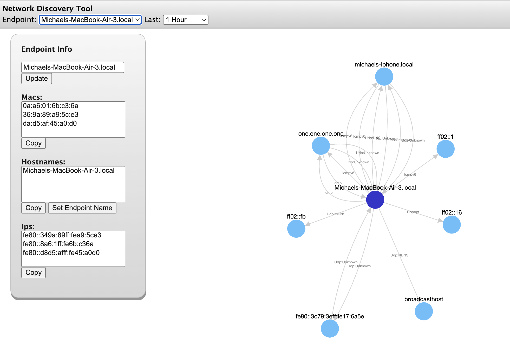

Rust Network Discovery Tool



A lightweight network traffic monitoring tool that captures and visualizes network connections on your local network. Shows "what's talking to what" in an easy-to-use web interface.

## Features

- **Smart Interface Filtering**: Automatically monitors only real network interfaces (skips loopback, Docker, VPN)
- **Connection Deduplication**: Tracks unique connections instead of individual packets 
- **Automatic Data Retention**: Keeps data for 7 days by default (configurable)
- **Privacy-Focused**: Doesn't store packet payloads, only connection metadata
- **Interactive Network Graph**: Click-to-navigate network visualization powered by Cytoscape.js
- **Protocol Detection**: Identifies HTTP, HTTPS, DNS, SSH, and 20+ other protocols
- **Hostname Resolution**: Uses DNS, mDNS, and deep packet inspection (SNI, HTTP Host headers)
- **DNS Caching**: Prevents slow lookups with DNS cache
- **High Performance**: Optimized with database indexes, transaction batching, and connection pooling

## Installation

### Pre-built Binaries

Download the latest release for your platform from the [Releases page](https://github.com/mikemiles-dev/rust_network_discovery_tool/releases/latest):

- **macOS (Apple Silicon)**: `awareness-macos-aarch64.tar.gz`
- **macOS (Intel)**: `awareness-macos-x86_64.tar.gz`
- **Linux**: `awareness-linux-x86_64.tar.gz`
- **Windows**: `awareness-windows-x86_64.zip`

#### macOS/Linux Installation

```bash
# Download and extract (adjust filename for your platform)
tar -xzf awareness-macos-aarch64.tar.gz

# Make executable
chmod +x awareness

# Move to PATH (optional)
sudo mv awareness /usr/local/bin/

# Run with sudo (required for packet capture)
sudo awareness
```

Then open http://localhost:8080 in your browser.

#### Windows Installation

1. Download and extract the ZIP file from the releases page
2. **Install Npcap** (required for packet capture):
   - Download from: https://npcap.com/#download
   - Run the installer with default options
   - Npcap provides the packet capture drivers that `awareness.exe` needs to monitor network traffic
   - Alternative: WinPcap also works but Npcap is recommended and actively maintained
3. Run PowerShell or Command Prompt as Administrator
4. Navigate to the extracted folder and run `awareness.exe`

Then open http://localhost:8080 in your browser.

**Important for Windows users**: While the `awareness.exe` binary is fully statically linked (no DLL dependencies for Rust code), it still requires Npcap/WinPcap drivers to be installed on your system. These are kernel-mode drivers that enable packet capture on Windows and cannot be bundled with the application.

### Build from Source

Requirements:
- Rust 1.70+
- libpcap (Linux/macOS) or Npcap (Windows)

```bash
git clone https://github.com/mikemiles-dev/rust_network_discovery_tool.git
cd rust_network_discovery_tool
cargo build --release
```

The binary will be in `target/release/awareness`.

## Usage

Basic:
```bash
cargo run
```

With configuration:
```bash
# Monitor specific interface(s)
MONITOR_INTERFACES="en0" cargo run

# Multiple interfaces
MONITOR_INTERFACES="en0,eth0" cargo run

# Custom database location
DATABASE_URL="my_network.db" cargo run

# Custom data retention (in days)
DATA_RETENTION_DAYS=30 cargo run

# Combine options
MONITOR_INTERFACES="en0" DATA_RETENTION_DAYS=14 DATABASE_URL="network.db" cargo run
```

## Environment Variables

| Variable | Default | Description |
|----------|---------|-------------|
| `MONITOR_INTERFACES` | Auto-detect | Comma-separated list of interfaces to monitor (e.g., "en0,eth0") |
| `DATABASE_URL` | `test.db` | Path to SQLite database file |
| `DATA_RETENTION_DAYS` | `7` | Number of days to keep historical data |
| `CHANNEL_BUFFER_SIZE` | `10000000` | Internal packet buffer size |

## How It Works

1. **Captures packets** on selected network interfaces using libpnet
2. **Deduplicates connections**: Only stores unique (source, destination, protocol) tuples
3. **Updates last_seen_at** and packet_count for existing connections
4. **Resolves hostnames** using DNS, mDNS, and packet inspection
5. **Displays in web UI** with interactive graph visualization
6. **Cleans up old data** automatically based on retention policy

## Platform Support

- **macOS**: Full support (Intel and Apple Silicon)
- **Linux**: Full support (x86_64)
- **Windows**: Full support - requires [Npcap](https://npcap.com/#download) drivers to be installed (see Installation section above)

## Privacy & Security

- **No payload storage**: Only connection metadata is stored
- **Local-only web UI**: Binds to 127.0.0.1 (not exposed to network)
- **No authentication**: Intended for personal use on trusted machines
- **Root/Admin required**: Packet capture requires elevated privileges